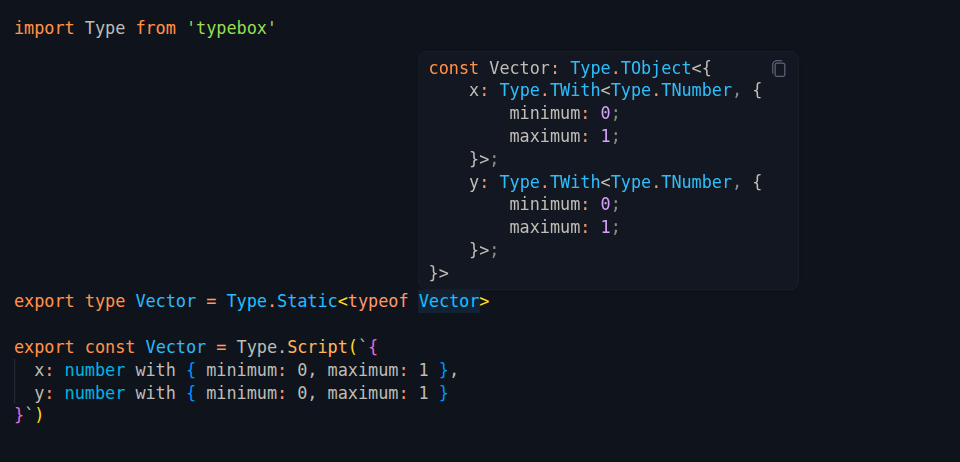

# TypeBox Highlight

Syntax highlighting for embedded TypeScript types

## Overview

This is a VS Code extension project that enables syntax highlighting for TypeScript types embedded in Template Literal strings.

Licence MIT

## Reference

The highlights will use the current VS Code color theme.

